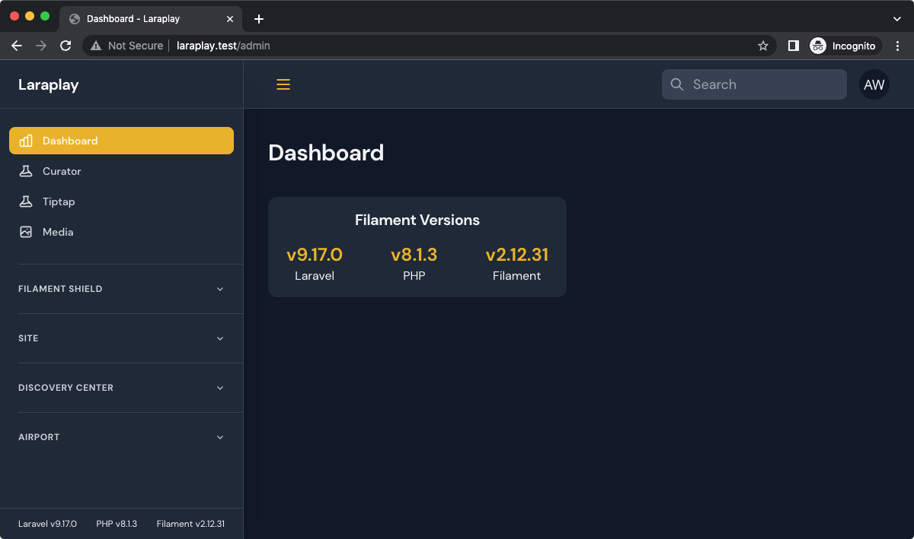
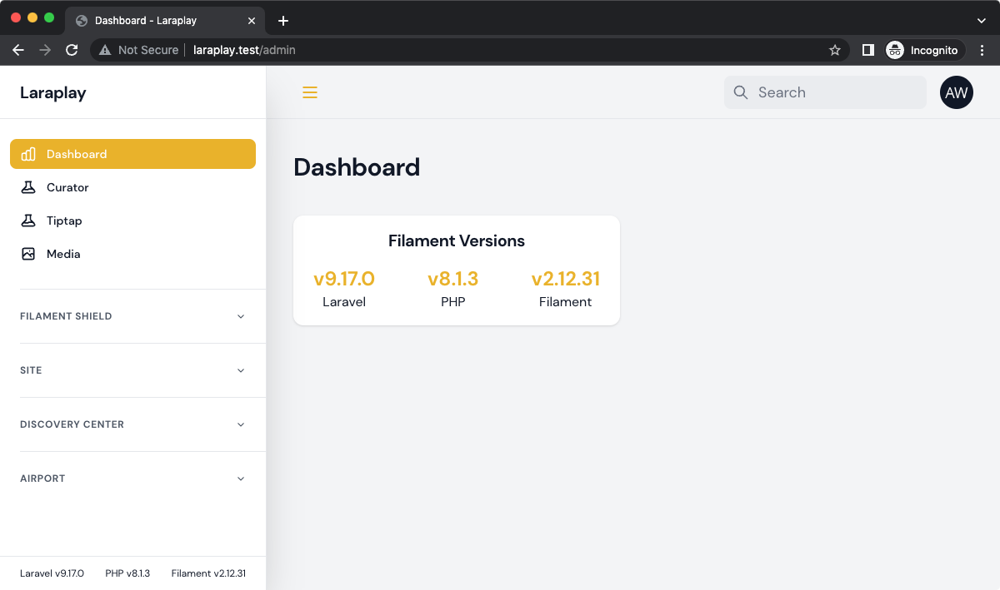

# Filament Versions

A mostly useless package to display framework versions at the bottom of the Filament Admin navigation panel and an optional widget to do the same in the dashboard or custom pages.





## Installation

Install the package via composer

```bash
composer require awcodes/filament-versions
```

## Usage

The navigation panel is loaded automatically.

To use the widget, just include it either in your `filament.php` config file under the 'widgets' section:

```php
'widgets' => [
    'namespace' => 'App\\Filament\\Widgets',
    'path' => app_path('Filament/Widgets'),
    'register' => [
        ...
        \FilamentVersions\FilamentVersionsWidget::class
    ],
],
```

Or

The widget can also be included as a normal Livewire component on any custom pages, etc:

```php
<filament-versions-widget />
```

## Disabling Navigation View

If you'd like to disable the navigation view and only use the dashboard 
widget you may do so by using the `registerNavigationView` method on 
the `FilamentVersions` facade in a service provider's `register` handler.

```php
use FilamentVersions\Facades\FilamentVersions;

public function register()
{
    FilamentVersions::registerNavigationView(false);
}
```

## Custom Version Items

You can also add your own versions by simply including the 
`FilamentVersions` facade and adding items inside the `boot` method of a 
service provider in your app.

```php
use FilamentVersions\Facades\FilamentVersions;

public function boot()
{
    ...
    FilamentVersions::addItem('Test', 'v1.2.3');
    FilamentVersions::addItem('App', 'v12.1.82');
}
```

The second parameter of addItem() can also except a Closure, but it must return a string.
